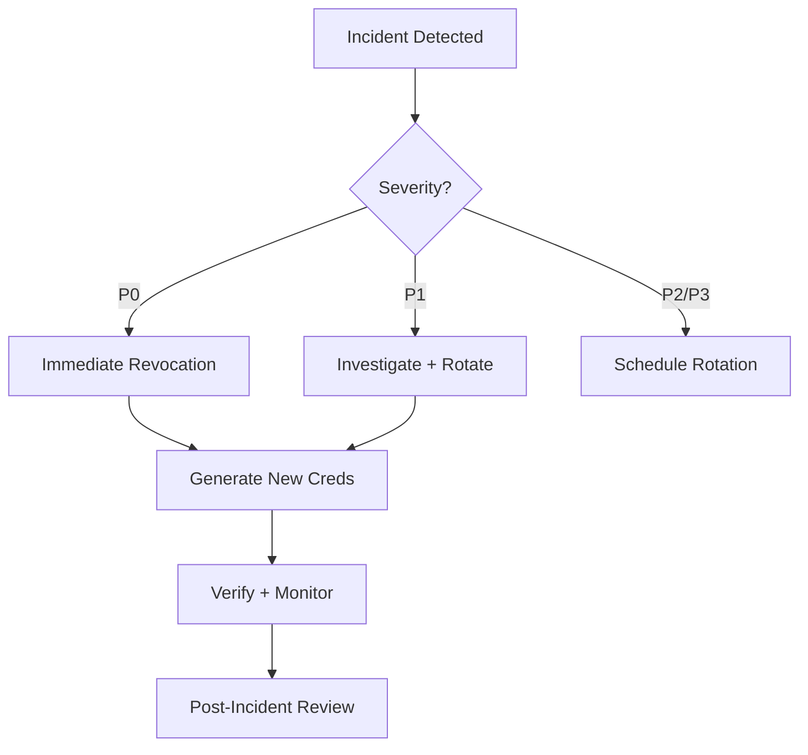

# Security Policy — MM Rebate Bot

**Version:** 1.0  
**Last Updated:** 2025-01-27  
**Owner:** Security Team

---

## Table of Contents

1. [Overview](#overview)
2. [Secrets Management](#secrets-management)
3. [Secret Storage Schema](#secret-storage-schema)
4. [Rotation Policy](#rotation-policy)
5. [Access Control](#access-control)
6. [Break-Glass Procedures](#break-glass-procedures)
7. [Audit Trail](#audit-trail)
8. [Incident Response](#incident-response)
9. [Reporting Vulnerabilities](#reporting-vulnerabilities)

---

## Overview

This document outlines the security policies and procedures for the MM Rebate Bot project, with a focus on **secrets management**, **access control**, and **incident response**.

### Security Objectives

1. **Confidentiality**: Prevent unauthorized access to secrets (API keys, credentials, tokens)
2. **Integrity**: Ensure secrets are not tampered with
3. **Availability**: Secrets are accessible to authorized services with minimal latency
4. **Auditability**: All access to secrets is logged for compliance and forensics

---

## Secrets Management

### Architecture

```
┌─────────────────────────────────────────────────────────────┐
│                    AWS Secrets Manager                       │
│  - Encrypted at rest (AWS KMS)                              │
│  - Automatic rotation (90 days)                             │
│  - IAM role-based access                                    │
└─────────────────────────────────────────────────────────────┘
                          ▲
                          │ HTTPS/TLS 1.3
                          │
          ┌───────────────┴───────────────┐
          │                               │
┌─────────▼─────────┐         ┌──────────▼──────────┐
│  GitHub Actions   │         │  Live Trading Bot   │
│  (OIDC role)      │         │  (EC2/ECS role)     │
└───────────────────┘         └─────────────────────┘
```

### Key Principles

1. **No Hardcoded Secrets**: All secrets stored in AWS Secrets Manager
2. **IAM Role-Based Access**: No long-lived credentials in code or CI/CD
3. **Encryption at Rest**: AWS KMS-managed encryption keys
4. **Encryption in Transit**: TLS 1.3 for all API calls
5. **Automatic Rotation**: Secrets rotated every 90 days
6. **Least Privilege**: Services only access secrets they need

---

## Secret Storage Schema

### Secret Naming Convention

Format: `{environment}/{service}/{secret_type}`

Examples:
- `prod/bybit/api` — Bybit API credentials (production)
- `staging/bybit/api` — Bybit API credentials (staging)
- `dev/bybit/api` — Bybit API credentials (development)
- `prod/db/password` — Database password
- `prod/telegram/bot_token` — Telegram bot token for alerts

### Secret Structure (JSON)

#### API Credentials

```json
{
  "api_key": "your_api_key_here",
  "api_secret": "your_api_secret_here",
  "created_at": "2025-01-01T00:00:00Z",
  "created_by": "security-team",
  "rotation_schedule": "90_days"
}
```

#### Database Credentials

```json
{
  "username": "db_user",
  "password": "db_password",
  "host": "db.example.com",
  "port": 5432,
  "database": "mm_bot_prod"
}
```

### Secret Metadata (AWS Tags)

| Tag Key | Description | Example |
|---------|-------------|---------|
| `Environment` | Deployment environment | `prod`, `staging`, `dev` |
| `Service` | Service using this secret | `bybit`, `telegram`, `db` |
| `Owner` | Team responsible | `trading-team`, `platform-team` |
| `RotationEnabled` | Auto-rotation enabled | `true`, `false` |
| `LastRotated` | Last rotation timestamp | `2025-01-01T00:00:00Z` |
| `CriticalityLevel` | Secret criticality | `critical`, `high`, `medium` |

---

## Rotation Policy

### Automatic Rotation

**Policy**: All production secrets **MUST** be rotated every **90 days**.

**Rotation Schedule**:
- **Production**: 90 days
- **Staging**: 120 days (or on-demand)
- **Development**: Manual (on-demand)

### Rotation Process

1. **Pre-Rotation Validation**:
   - Verify new credentials work (test API calls)
   - Ensure no active trades or critical operations

2. **Rotation Execution**:
   - AWS Secrets Manager triggers Lambda function
   - Lambda generates new credentials via exchange API
   - Lambda stores new credentials in Secrets Manager
   - Old credentials marked as `AWSPENDING` (grace period: 24h)

3. **Post-Rotation Validation**:
   - Application fetches new credentials (cache refresh)
   - Smoke test: verify API connectivity
   - Monitor error rates for 1 hour
   - Mark old credentials as `AWSPREVIOUS` (deprecated)

4. **Grace Period**:
   - Old credentials remain valid for **24 hours**
   - Allows rollback if issues detected
   - After grace period, old credentials invalidated

### Manual Rotation (Emergency)

**Trigger Conditions**:
- Suspected credential compromise
- Key leaked in logs/code
- Unauthorized access detected
- Employee offboarding

**Procedure**: See [Break-Glass Procedures](#break-glass-procedures)

---

## Access Control

### IAM Roles and Policies

#### GitHub Actions (CI/CD)

**Role**: `github-actions-mm-bot-role`

**Trust Policy** (OIDC):
```json
{
  "Version": "2012-10-17",
  "Statement": [
    {
      "Effect": "Allow",
      "Principal": {
        "Federated": "arn:aws:iam::123456789012:oidc-provider/token.actions.githubusercontent.com"
      },
      "Action": "sts:AssumeRoleWithWebIdentity",
      "Condition": {
        "StringEquals": {
          "token.actions.githubusercontent.com:aud": "sts.amazonaws.com",
          "token.actions.githubusercontent.com:sub": "repo:your-org/mm-bot:ref:refs/heads/main"
        }
      }
    }
  ]
}
```

**Permissions** (read-only for CI):
```json
{
  "Version": "2012-10-17",
  "Statement": [
    {
      "Effect": "Allow",
      "Action": [
        "secretsmanager:GetSecretValue"
      ],
      "Resource": [
        "arn:aws:secretsmanager:us-east-1:123456789012:secret:dev/*",
        "arn:aws:secretsmanager:us-east-1:123456789012:secret:staging/*"
      ]
    }
  ]
}
```

#### Live Trading Bot (Production)

**Role**: `live-trading-bot-prod-role`

**Permissions**:
```json
{
  "Version": "2012-10-17",
  "Statement": [
    {
      "Effect": "Allow",
      "Action": [
        "secretsmanager:GetSecretValue",
        "secretsmanager:DescribeSecret"
      ],
      "Resource": [
        "arn:aws:secretsmanager:us-east-1:123456789012:secret:prod/bybit/api-*",
        "arn:aws:secretsmanager:us-east-1:123456789012:secret:prod/telegram/bot_token-*"
      ]
    },
    {
      "Effect": "Allow",
      "Action": [
        "kms:Decrypt"
      ],
      "Resource": "arn:aws:kms:us-east-1:123456789012:key/kms-key-id"
    }
  ]
}
```

### Least Privilege Matrix

| Environment | Service | Read | Write | Rotate | Delete |
|-------------|---------|------|-------|--------|--------|
| **Production** | Trading Bot | ✅ | ❌ | ❌ | ❌ |
| **Production** | Rotation Lambda | ✅ | ✅ | ✅ | ❌ |
| **Production** | Security Team | ✅ | ✅ | ✅ | ✅ |
| **Staging** | GitHub Actions | ✅ | ❌ | ❌ | ❌ |
| **Dev** | GitHub Actions | ✅ | ✅ | ❌ | ❌ |

---

## Break-Glass Procedures

### Emergency Secret Rotation

**Scenario**: Credential compromise detected (leaked key, unauthorized access, etc.)

**Procedure**:

#### Step 1: Immediate Revocation (< 5 minutes)

```bash
# 1. Invalidate compromised key on exchange (Bybit example)
aws secretsmanager get-secret-value \
  --secret-id prod/bybit/api \
  --query SecretString \
  --output text | jq -r '.api_key'

# Copy API key, then revoke via exchange UI:
# https://www.bybit.com/app/user/api-management

# 2. Mark secret for rotation
aws secretsmanager rotate-secret \
  --secret-id prod/bybit/api \
  --rotation-lambda-arn arn:aws:lambda:us-east-1:123456789012:function:bybit-rotate
```

#### Step 2: Generate New Credentials (< 10 minutes)

```bash
# Option A: Auto-rotation (preferred)
# Wait for Lambda to complete (check CloudWatch Logs)
aws secretsmanager describe-secret \
  --secret-id prod/bybit/api \
  --query 'RotationEnabled'

# Option B: Manual rotation (if Lambda fails)
# 1. Generate new key via exchange UI
# 2. Update secret manually
NEW_SECRET=$(jq -n \
  --arg key "NEW_API_KEY" \
  --arg secret "NEW_API_SECRET" \
  '{api_key: $key, api_secret: $secret}')

aws secretsmanager put-secret-value \
  --secret-id prod/bybit/api \
  --secret-string "$NEW_SECRET"
```

#### Step 3: Verify and Monitor (< 30 minutes)

```bash
# 1. Restart trading bot (force cache clear)
kubectl rollout restart deployment/live-trading-bot -n prod

# 2. Monitor error rates
kubectl logs -f deployment/live-trading-bot -n prod | grep -i "auth\|401\|403"

# 3. Check exchange API status
# Verify new key works via Postman/curl

# 4. Notify team
# Post to #security-incidents Slack channel
```

#### Step 4: Post-Incident Review (< 24 hours)

1. **Root Cause Analysis**: How was the secret compromised?
2. **Impact Assessment**: What systems were affected?
3. **Remediation**: What controls need to be strengthened?
4. **Documentation**: Update runbooks and security policies

---

## Audit Trail

### AWS CloudTrail Logging

**All secret access is logged** to AWS CloudTrail with the following fields:

- `eventName`: API action (e.g., `GetSecretValue`, `PutSecretValue`)
- `eventTime`: Timestamp (UTC)
- `userIdentity`: IAM role or user
- `sourceIPAddress`: Originating IP
- `requestParameters`: Secret ID (ARN)
- `responseElements`: Success/failure status

**Retention**: CloudTrail logs retained for **90 days**, then archived to S3 (7 years).

**Alerting**: CloudWatch Alarms trigger on:
- Unauthorized access attempts (`AccessDenied` errors)
- Secret deletion attempts
- Unusual access patterns (rate limit: 100 calls/hour per secret)

### Application-Level Audit

**tools/live/secrets.py** logs all secret access:

```python
logger.info(
    "[AUDIT] Secret access: "
    f"secret_id=prod/bybit/***  "
    f"accessor=github-actions-role, "
    f"action=read, "
    f"success=True, "
    f"timestamp=2025-01-27T10:00:00Z"
)
```

**Log Destination**: CloudWatch Logs → S3 archive (90 days)

---

## Incident Response

### Severity Levels

| Level | Description | Response Time | Examples |
|-------|-------------|---------------|----------|
| **P0 (Critical)** | Confirmed credential compromise, active exploit | < 5 min | API key leaked on GitHub, unauthorized trades |
| **P1 (High)** | Suspected compromise, anomalous access | < 30 min | Unusual API calls, 403 errors spike |
| **P2 (Medium)** | Policy violation, non-critical exposure | < 4 hours | Expired secret not rotated, weak key detected |
| **P3 (Low)** | Security enhancement, audit finding | < 7 days | Missing tag, non-compliant secret naming |

### Incident Response Workflow



### On-Call Contacts

| Role | Contact | Escalation Path |
|------|---------|-----------------|
| Security Lead | security-lead@example.com | Platform Lead → CTO |
| DevOps Lead | devops-lead@example.com | Security Lead |
| Trading Team Lead | trading-lead@example.com | Platform Lead |

---

## Reporting Vulnerabilities

### Responsible Disclosure

**Email**: security@example.com  
**PGP Key**: [Download public key](https://example.com/security.asc)

**Response SLA**:
- Initial acknowledgment: < 24 hours
- Triage and severity assessment: < 72 hours
- Fix timeline: Varies by severity (P0: < 7 days, P1: < 30 days)

### Scope

**In Scope**:
- Secret leakage (code, logs, artifacts)
- Unauthorized secret access
- AWS IAM misconfigurations
- Encryption weaknesses
- Rotation bypass

**Out of Scope**:
- Social engineering attacks
- Physical security
- Third-party services (e.g., Bybit exchange)

---

## Compliance

### Standards

- **SOC 2 Type II**: Controls for confidentiality and availability
- **ISO 27001**: Information security management
- **PCI DSS** (if applicable): Payment card data protection

### Audit Schedule

- **Internal Audit**: Quarterly
- **External Audit**: Annually (SOC 2)
- **Penetration Testing**: Bi-annually

---

## Appendix

### Useful Commands

#### List all secrets

```bash
aws secretsmanager list-secrets --query 'SecretList[*].[Name,LastRotatedDate]' --output table
```

#### Get secret metadata (no value)

```bash
aws secretsmanager describe-secret --secret-id prod/bybit/api
```

#### Force cache clear (Python)

```python
from tools.live.secrets import clear_cache
clear_cache()
```

#### Test secret retrieval

```bash
python -c "from tools.live.secrets import get_api_credentials; print(get_api_credentials('dev', 'bybit'))"
```

---

## Document History

| Version | Date | Author | Changes |
|---------|------|--------|---------|
| 1.0 | 2025-01-27 | Security Team | Initial version |

---

**Last Reviewed**: 2025-01-27  
**Next Review Due**: 2025-04-27 (90 days)

